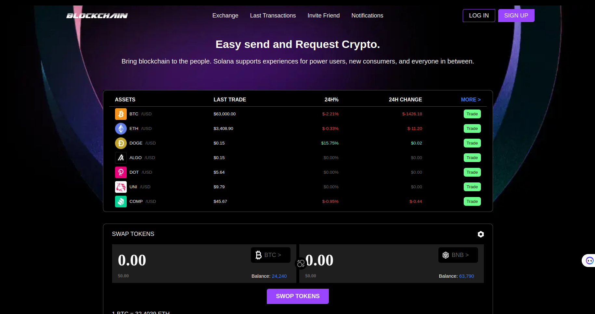

# Crypto Next App

This is a [Next.js](https://nextjs.org/) project bootstrapped with [`create-next-app`](https://github.com/vercel/next.js/tree/canary/packages/create-next-app).

## Technologies Used

- Next.js: A React framework for building server-rendered, static, and dynamic websites and applications.
- Tailwind CSS: A utility-first CSS framework for rapidly building custom designs.
- TypeScript: A superset of JavaScript that adds optional static typing to the language.
- Prisma: An open-source database toolkit that includes an ORM (Object-Relational Mapping) for interacting with databases.
- PostgreSQL: A powerful, open-source object-relational database system.

## Getting Started

First, run the development server:

```bash
npm run dev
# or
yarn dev
# or
pnpm dev
```
[Crypto Live Demo](https://crypto-next-mkm6.vercel.app)